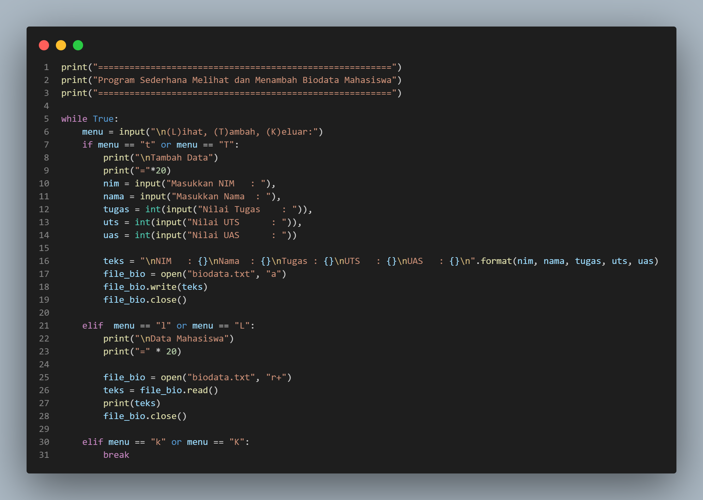
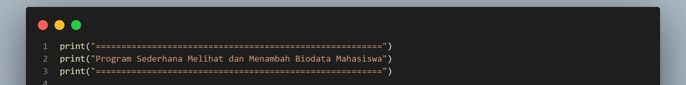
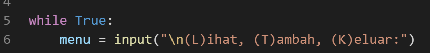
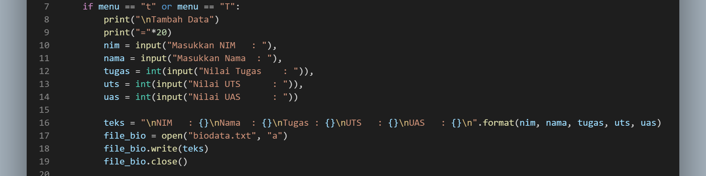
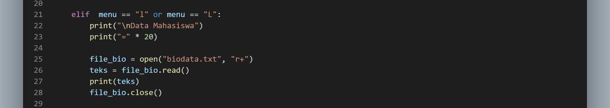
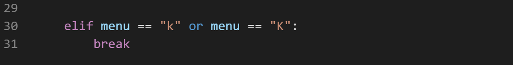

# Mempraktekkan Exception 

Lihatlah Source Code dibawah ini :  

 
 
 Disini kita mencoba mengecek apakah ada 'file.txt', ada kalanya kita lupa untuk membuat file dan disitulah akan terjadi eror diatas kita membuat contoh eror menggunakan exception.  
 

# Membuat Program Sederhana Input Nilai Mahasiswa dengan Class

Pertama coba kita simak source code yang sudah saya buat sebelumnya :  

 

Penjelasan : 
 
Pertama disini saya membuat judul dari sebuah program dengan print() 

 

Selanjutnya saya membuat perulangan dengan while untuk mengulang menu inputan data yang diinputkan, saya juga membuat menu untuk menambah data dan melihat data. 

 

Membuat syntak menambah data : 

 

Membuat pengkondisian jika menu yang diinputkan 't' maka akan menjalankan code untuk menambahkan data ke dalam file yang kita inginkan. Disini ada beberapa atribut seperti nim, nama, tugas, uts, dan uas, saya menggunakan perintah 'a' dalam "file_bio = open("biodata.txt", "a")" untuk memasukan atribut yang sudah diinputkan ke dalam file 'biodata.txt' sebelumnya kita harus mempersiapkan file .txt untuk menyinpan data yang kita inputkan. 

Membuat syntak menampilkan data : 

 

jika kita menginputkan 'l' maka program akan menjalankan perintah unutuk mnenampilkan data yang sudah kita inputkan. 

 

dan jika kita ingin mengakhiri program kita bisa menginputkan 'k' unruk keluar dari program. 

